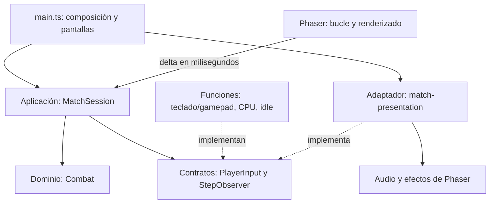

# ADR: sesión de partida independiente del navegador

Estado: aceptada para un piloto incremental.

## Contexto y decisión

El combate ya contiene reglas independientes de Phaser. Antes del piloto,
`main.ts` además leía dispositivos, acumulaba tiempo, ejecutaba pasos, detectaba
transiciones, reproducía sonidos, generaba efectos y mostraba resultados.

Se extrae la coordinación a `MatchSession`, una capa de aplicación sobre
`Combat`. El navegador continúa siendo una única aplicación local. La separación
se aplica a este recorrido; no se reorganiza todo el proyecto.



Las flechas continuas representan uso; las punteadas, implementación de contratos.
La sesión importa únicamente el dominio y su vista de lectura. No importa
adaptadores ni consulta relojes, DOM, almacenamiento o dispositivos.

## Contratos y comportamiento

- `start({ practice, inputs })` crea un combate nuevo y reinicia el acumulador.
  Hay dos funciones `PlayerInput`, consultadas en orden P1/P2 por cada paso.
  La práctica se conecta con `idle` en P2; la CPU conserva su controlador por partida.
- `advance(deltaMs)` conserva pasos de `1000 / 60`, sin límite nuevo de recuperación
  de cuadros atrasados. Tiempos negativos o no finitos se ignoran.
- `beforeStep` captura la información necesaria antes de consultar entradas;
  `afterStep` recibe el estado después de simular. Ambos son síncronos. Los
  observadores leen y presentan; no llaman operaciones de ciclo de vida de la sesión.
- El adaptador conserva este orden: sonidos de transición, polvo de aterrizaje,
  sonido/partícula/flash/cámara por impacto y actualización de efectos.
- `pause()` descarta el sobrante temporal. El tiempo pausado no se acumula.
  `resume()` limpia los botones previos del combate, como hacía la interfaz.
- La victoria detiene la sesión, limpia combos y notifica una vez, después de
  presentar el último paso. `finish()` abandona sin anunciar un ganador.
- `resetPractice()` conserva el reinicio anterior de posiciones y reloj de ronda;
  no crea otra partida ni altera el sobrante temporal.
- `combat` es una vista viva de lectura (`CombatState`), sin métodos de mutación.
  Su protección es estática en TypeScript, no una copia ni congelación en ejecución.
  Quien necesite historia debe capturar valores antes del siguiente paso.

`main.ts` conecta las dependencias directamente, conserva el estado de las pantallas
y actualiza el HUD. El menú usa un combate de presentación separado de la sesión
activa. Los adaptadores de entrada son funciones pequeñas en la composición; no
necesitan una clase ni un archivo por dispositivo.

## SOLID en este ejemplo

| Principio             | Decisión observable                                                             |
| --------------------- | ------------------------------------------------------------------------------- |
| Responsabilidad única | La sesión coordina; Combat resuelve reglas; el adaptador presenta.              |
| Abierto/cerrado       | Otra fuente de entradas se conecta sin modificar la sesión.                     |
| Sustitución           | Cada fuente devuelve un InputFrame por consulta y respeta el estado de lectura. |
| Segregación           | Entrada y observación son contratos separados y pequeños.                       |
| Inversión             | La aplicación declara contratos que implementa el exterior.                     |

Antes, probar el recorrido completo exigía cargar `main.ts` y el navegador.
Ahora se puede iniciar una sesión con funciones programadas:

```ts
const session = new MatchSession();
session.start({
  practice: true,
  inputs: [() => ({ ...idle(), right: true }), idle],
});
session.advance(1000 / 60);
session.pause();
// session.combat permite consultar el resultado sin Phaser.
```

## Validación y límites

Las pruebas comparan la sesión con una copia de caracterización del bucle anterior,
con tiempos fraccionarios, múltiples pasos, entradas programadas y CPU reproducible.
Se comparan estados y secuencias audiovisuales completas, incluidas rondas e impactos.
Una prueba de límites compila la aplicación con ECMAScript sin tipos DOM ni Node
y comprueba que sus dependencias sean únicamente dominio y aplicación.
Las pruebas de navegador cubren integración, controles, práctica, pausa, resultados,
revancha y torneos. La compilación verifica los consumidores de la vista de lectura.

El helper de caracterización se mantiene como referencia independiente; no debe
reescribirse para delegar en la nueva sesión. Cambios futuros de reglas requieren
revisar explícitamente qué invariantes del comportamiento deben conservarse.

No se introduce un bus de eventos, contenedor de inyección, jerarquía de servicios
ni una abstracción de cada función. Persistencia, catálogo visual y pantallas quedan
para otro piloto. No se promete determinismo de CPU entre ejecuciones con su azar
por defecto: en las pruebas se inyecta una fuente reproducible.
